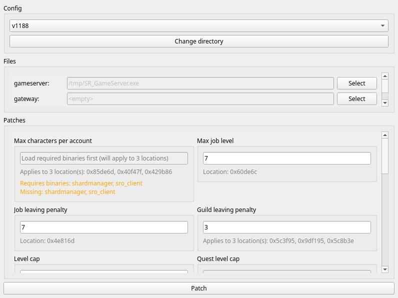

# Private Files Patcher



A graphical tool for patch private server files (silkroad).

## Features

- Graphical user interface built with PyQt6
- Support for multiple binary files in a single configuration
- Editable patches with real-time value input
- Pattern-based patching with wildcard support
- Formula support for calculated values
- Automatic backup of original bytes before patching
- Restore functionality to revert patches
- Persistent patch directory (works with PyInstaller distributions)

## Installation

### Pre-built Executables

Download the latest release from the [Releases](https://github.com/dadav/pfpatch/releases) page:

- Windows: `pfpatch-vX.X.X-windows.exe`
- Linux: `pfpatch-vX.X.X-linux`

Extract and run the executable. On first run, bundled patch files will be copied to a `patches` directory next to the executable.

### From Source

Requirements:

- Python 3.12 or higher
- pip or uv package manager

Install dependencies:

```bash
pip install -r requirements.txt
# or with uv
uv sync
```

Run the application:

```bash
python pfpatch.py
# or with uv
uv run pfpatch.py
```

## Usage

1. **Launch the application** - The GUI will open with the Config section at the top.

2. **Select patch configuration** - Use the dropdown to select a YAML configuration file from the patches directory.

3. **Load binary files** - For each binary file required by the patches:
   - Click "Select" next to the binary name
   - Navigate to and select the target executable file
   - The path will be saved for future sessions

4. **Configure patches**:
   - **Editable patches**: Enter a numeric value in the text field
   - **Non-editable patches**: Check the checkbox to enable the patch

5. **Apply patches** - Click the "Patch" button to apply all enabled patches to the binary files.

6. **Restore patches** - To revert changes:
   - For editable patches: Clear the value field and apply
   - For non-editable patches: Uncheck the checkbox and apply

## Configuration File Format

Configuration files are YAML files that define binary files and patches. Place them in the `patches` directory.

### Basic Structure

```yaml
files:
  binary_name:
    default: "DefaultFileName.exe"

patches:
  - name: "Patch Name"
    description: "Optional description"
    editable: false
    file: binary_name
    changes:
      - offset: 0x123456
        value: "48 8B 05"
```

### Files Section

Define the binary files that can be patched:

```yaml
files:
  gameserver:
    default: "SR_Gameserver.exe"
  gateway:
    default: "GatewayServer.exe"
  sro_client:
    default: "sro_client.exe"
```

The `default` field is optional and used as a hint in the file selection dialog.

### Patches Section

#### Simple Non-Editable Patch

A patch that replaces bytes with a fixed value:

```yaml
patches:
  - name: "Disable login captcha"
    description: "Removes the login captcha requirement"
    editable: false
    file: gateway
    changes:
      - offset: 0x40509d
        value: "30 6e 40"
```

#### Multiple Changes in One Patch

Apply the same patch to multiple locations:

```yaml
patches:
  - name: "Fix crash after level 110"
    editable: false
    file: gameserver
    changes:
      - offset: 0x4e5475
        value: "E0"
      - offset: 0x4e5476
        value: "E1"
      - offset: 0x4e5477
        value: "E2"
```

#### Editable Patch (Single Byte)

Allow users to input a value that gets written to the binary:

```yaml
patches:
  - name: "Max characters per account"
    description: "Adjust the number of characters per account"
    editable: true
    file: sro_client
    changes:
      - offset: 0x85de6d
        size: 1
```

#### Editable Patch (Multiple Bytes)

For values larger than one byte, specify the size:

```yaml
patches:
  - name: "Max job level"
    editable: true
    file: gameserver
    changes:
      - offset: 0x60de6c
        size: 4
```

#### Editable Patch with Multiple Locations

Apply the same value to multiple offsets:

```yaml
patches:
  - name: "Level cap"
    editable: true
    file: gameserver
    changes:
      - offset: 0x4e52c9
        size: 1
      - offset: 0x4d641e
        size: 1
```

#### Patch Multiple Files

A single patch can modify multiple binary files:

```yaml
patches:
  - name: "Max characters per account"
    editable: true
    file: client
    changes:
      - offset: 0x85de6d
        size: 1
      - offset: 0x40F47F
        size: 1
        file: shardmanager
      - offset: 0x429B86
        size: 1
        file: shardmanager
```

#### Pattern-Based Patching

Use pattern matching instead of fixed offsets. Useful when offsets change between versions:

```yaml
patches:
  - name: "Patch using pattern"
    editable: false
    file: gameserver
    changes:
      - pattern: "48 8B 05 ?? ?? ?? ??"
        value: "90 90 90 90 90 90 90"
```

Pattern format:

- Hex bytes separated by spaces
- `??` represents a wildcard byte (matches any value)
- Example: `"48 8B 05 ?? ?? ?? ??"` matches `48 8B 05` followed by any 4 bytes

#### Pattern with Offset

Apply the patch at a specific offset within the matched pattern:

```yaml
patches:
  - name: "Patch pattern with offset"
    editable: false
    file: gameserver
    changes:
      - pattern: "48 8B 05 ?? ?? ?? ?? 89 45"
        pattern_offset: 3
        value: "90 90 90"
```

This matches the pattern and applies the patch 3 bytes into the match.

#### Editable Patch with Formula

Apply a formula to the input value before writing. The formula is applied per change:

```yaml
patches:
  - name: "Gameserver spawn limit"
    editable: true
    file: gameserver
    changes:
      - offset: 0x54d6da
        size: 4
        formula: "value * 0x1D0"
```

The formula uses Python syntax and must reference `value` as the input. Supported operations: `+`, `-`, `*`, `/`, `//`, `%`, `**`, `&`, `|`, `^`, `<<`, `>>`, and functions: `abs`, `min`, `max`, `pow`, `round`.

#### Display and Input Formulas

Convert between display values and stored values:

```yaml
patches:
  - name: "Guild leaving penalty"
    description: "The days of penalty for leaving a guild"
    editable: true
    file: gameserver
    changes:
      - offset: 0x5c3f95
        size: 4
        display_formula: "value / (24 * 60 * 60)"
        input_formula: "value * 24 * 60 * 60"
```

- `display_formula`: Converts stored value (seconds) to display value (days) when reading from binary
- `input_formula`: Converts display value (days) to stored value (seconds) when user enters a value

Users enter days, but the binary stores seconds.

#### Formula vs Input Formula

The key difference between `formula` and `input_formula`:

- **`input_formula`**: Applied **once per patch** to convert the user's input to a base stored value. Applied before per-change formulas.
- **`formula`**: Applied **per change** to calculate the final value written to each offset. Each change can have a different formula.

Processing order when applying a patch:

1. User enters value (e.g., "5" days)
2. `input_formula` converts to base stored value (e.g., `value * 86400` = 432000 seconds)
3. `formula` (per change) calculates final value (e.g., `value * 2` = 864000)

Example combining both:

```yaml
patches:
  - name: "Spawn limits with multiplier"
    editable: true
    file: gameserver
    changes:
      - offset: 0x54d6da
        size: 4
        input_formula: "value * 100"
        formula: "value * 0x1D0"
      - offset: 0x54d6e0
        size: 4
        input_formula: "value * 100"
        formula: "value * 0x200"
```

User enters "10":

- `input_formula` converts: 10 \* 100 = 1000 (base stored value)
- First change: 1000 \* 0x1D0 = 465920 (written to 0x54d6da)
- Second change: 1000 \* 0x200 = 524288 (written to 0x54d6e0)

#### Complex Example

Combining multiple features:

```yaml
patches:
  - name: "Complex patch example"
    description: "Example showing multiple features"
    editable: true
    file: gameserver
    changes:
      - offset: 0x4e816d
        size: 4
        display_formula: "value / 86400"
        input_formula: "value * 86400"
        formula: "value + 0x100"
      - pattern: "48 8B ?? ?? ?? ?? 89"
        pattern_offset: 2
        size: 4
        formula: "value * 2"
```

## Backup and Restore

The tool automatically creates backups before applying patches:

- Backup files are stored in the `backups` directory
- Format: `{binary_name}_backup.yaml`
- Contains original byte values at each patched offset

To restore:

- For editable patches: Clear the value and apply
- For non-editable patches: Uncheck the checkbox and apply

Backups are preserved even if you modify the same offset multiple times.

## Settings

Settings are saved in `settings.yml`:

- Binary file paths (persisted across sessions)
- Last selected configuration directory

## License

[Apache](./LICENSE)
